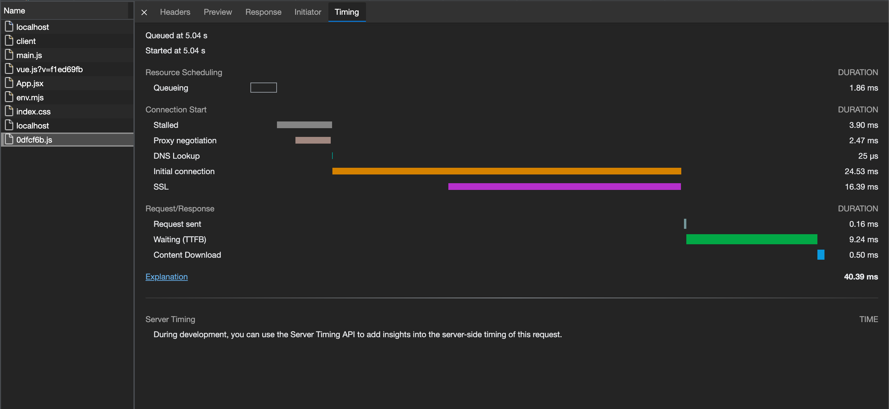

# dns-prefetch

## 介绍
“解析域名”流程前置化，减少跨域请求的时间。

## 语法
```js
<link rel="dns-prefetch" href="https://fonts.googleapis.com"> 
```

## 实例

> origin: http://localhost:3000

1. 未使用 dns-prefetch

```html
<!DOCTYPE html>
<html lang="en">
  <head>
    <meta charset="UTF-8" />
    <link rel="icon" href="/favicon.ico" />
    <meta name="viewport" content="width=device-width, initial-scale=1.0" />
    <!-- <link rel="dns-prefetch" href="https://plat-h5.cdnjtzy.com"> -->
    <title>Vite App</title>
  </head>
  <body>
    <script>
      setTimeout(() => {
        fetch('https://plat-h5.cdnjtzy.com/www/0dfcf6b.js')
      }, 5000)
    </script>
  </body>
</html>
```

<br />

通过 Timing 面板的内容可以看出，DNS 解析 `https://plat-h5.cdnjtzy.com` 域名花费了 `15.47 ms` 的时间。

2. 使用 dns-prefetch 提前解析域名

```html
<!DOCTYPE html>
<html lang="en">
  <head>
    <meta charset="UTF-8" />
    <link rel="icon" href="/favicon.ico" />
    <meta name="viewport" content="width=device-width, initial-scale=1.0" />
    <link rel="dns-prefetch" href="https://plat-h5.cdnjtzy.com">
    <title>Vite App</title>
  </head>
  <body>
    <script>
      setTimeout(() => {
        fetch('https://plat-h5.cdnjtzy.com/www/0dfcf6b.js')
      }, 5000)
    </script>
  </body>
</html>
```

<br />

因为域名已经提前解析完毕。通过 Timing 面板的内容可以看出，DNS 解析 `https://plat-h5.cdnjtzy.com` 域名花费了 `25 μs` 的时间，几乎等于未花费时间。
