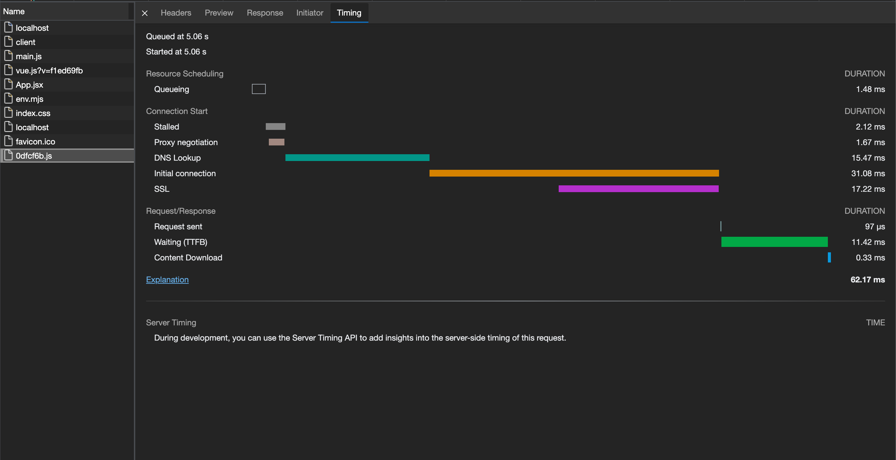
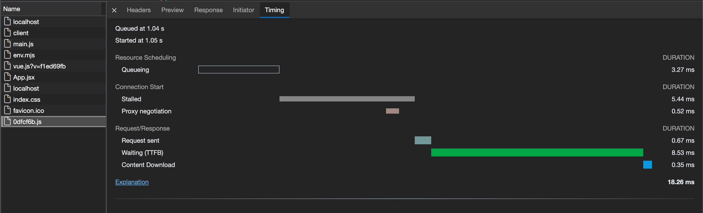

# preconnet

## 介绍
“解析域名”、“TCP三次握手”、“TLS协商（https协议）”这三个流程前置化，减少跨域请求的时间。

## 语法
```js
<link rel="preconnect" href="https://plat-h5.cdnjtzy.com/" crossorigin>
```

> tips: 因为 href 与 location.origin 之间的关系为 `跨域` ，需要在 link 标签上设置 `crossorigin` 属性。

 `crossorigin` 属性的情况：

  1. 当 `crossorigin="use-credentials"` 时表示为请求将携带 `cookie` 等之类的用户凭证信息；
  2. 其他情况下，表示 `anonymous` ，将不会携带 `cookie` 等之类的用户凭证信息。

## 实例
> origin: http://localhost:3000

1. 未使用 preconnet

```html
<!DOCTYPE html>
<html lang="en">
  <head>
    <meta charset="UTF-8" />
    <link rel="icon" href="/favicon.ico" />
    <meta name="viewport" content="width=device-width, initial-scale=1.0" />
    <!-- <link rel="preconnect" href="https://plat-h5.cdnjtzy.com/" crossorigin> -->
    <title>Vite App</title>
  </head>
  <body>
    <div id="app"></div>
    <script type="module" src="/src/main.js"></script>
    <script>
      setTimeout(() => {
        fetch('https://plat-h5.cdnjtzy.com/www/0dfcf6b.js')
      }, 5000)
    </script>
  </body>
</html>
```

<br />

通过 Timing 面板的内容可以看出，DNS 解析 `https://plat-h5.cdnjtzy.com` 域名花费了 `15.47 ms` 的时间；初始化连接花费了 `31.08 ms` 的时间；TLS协商花费了 `17.22 ms` 的时间；总共花费了 `46.55 ms` 的时间。

2. 使用 preconnect 提前建立服务连接

```html
<!DOCTYPE html>
<html lang="en">
  <head>
    <meta charset="UTF-8" />
    <link rel="icon" href="/favicon.ico" />
    <meta name="viewport" content="width=device-width, initial-scale=1.0" />
    <link rel="preconnect" href="https://plat-h5.cdnjtzy.com/" crossorigin>
    <title>Vite App</title>
  </head>
  <body>
    <div id="app"></div>
    <script type="module" src="/src/main.js"></script>
    <script>
      setTimeout(() => {
        fetch('https://plat-h5.cdnjtzy.com/www/0dfcf6b.js')
      }, 5000)
    </script>
  </body>
</html>
```

<br />

因为服务连接已经提前建立。通过 Timing 面板的内容对比上面的数据可以看出，省略了“解析域名”、“TCP三次握手”、“TLS协商（https协议）”这三个流程。

## 与 dns-prefetch 比较
与 dns-prefetch 比较，多执行了两步：“TCP三次握手”、“TLS协商（https协议）” 。
