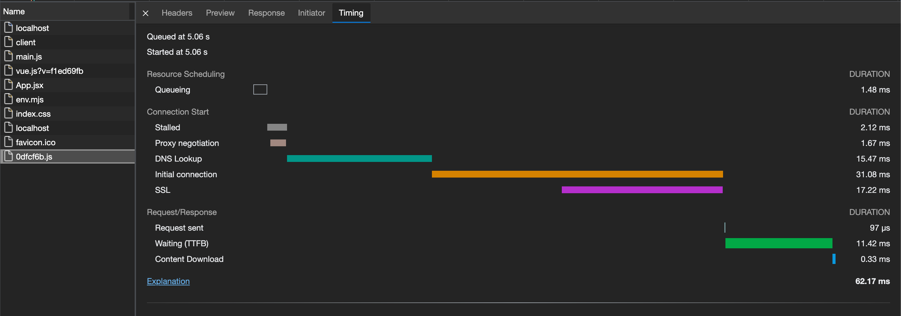
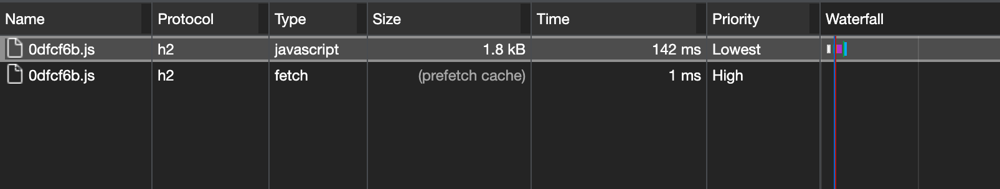
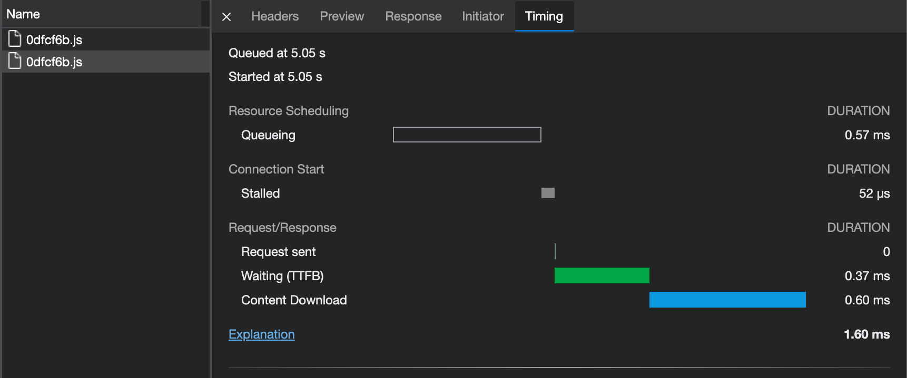

# prefetch

## 介绍
利用浏览器的空闲时间（`Priority - Lowest`），提前预加载资源，并且缓存在本地；未来需要获取该资源时，可以直接从缓存中获取。

## 语法
```js
<link rel="prefetch" href="/vendor.js">

// 跨域资源需要添加 crossorigin 属性
<link rel="prefetch" href="https://plat-h5.cdnjtzy.com/www/0dfcf6b.js" crossorigin>
```

## 实例
> origin: http://localhost:3000

1. 未使用 prefetch

```html
<!DOCTYPE html>
<html lang="en">
  <head>
    <meta charset="UTF-8" />
    <link rel="icon" href="/favicon.ico" />
    <meta name="viewport" content="width=device-width, initial-scale=1.0" />
    <!-- <link rel="prefetch" href="https://plat-h5.cdnjtzy.com/www/0dfcf6b.js" crossorigin> -->
    <title>Vite App</title>
  </head>
  <body>
    <div id="app"></div>
    <script type="module" src="/src/main.js"></script>

    <script>
      setTimeout(() => {
        fetch('https://plat-h5.cdnjtzy.com/www/0dfcf6b.js')
      }, 5000)
    </script>
  </body>
</html>
```

<br />

通过 Timing 面板的内容可以看出，经历了 ` DNS 解析`、`TCP三次握手`、`TLS协商（https协议）` 等流程。总共花费了 `62.17 ms` 的时间。

2. 使用 prefetch 预加载资源

```html
<!DOCTYPE html>
<html lang="en">
  <head>
    <meta charset="UTF-8" />
    <link rel="icon" href="/favicon.ico" />
    <meta name="viewport" content="width=device-width, initial-scale=1.0" />
    <link rel="prefetch" href="https://plat-h5.cdnjtzy.com/www/0dfcf6b.js" crossorigin>
    <title>Vite App</title>
  </head>
  <body>
    <div id="app"></div>
    <script type="module" src="/src/main.js"></script>

    <script>
      setTimeout(() => {
        fetch('https://plat-h5.cdnjtzy.com/www/0dfcf6b.js')
      }, 5000)
    </script>
  </body>
</html>
```

<br />
<br />

因为使用 `prefetch` 预加载资源。所以第二次加载资源时，直接从缓存中获取资源，总共花费 `1.60 ms` 的时候，几乎未花费时间。
