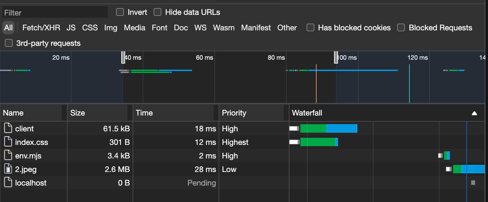
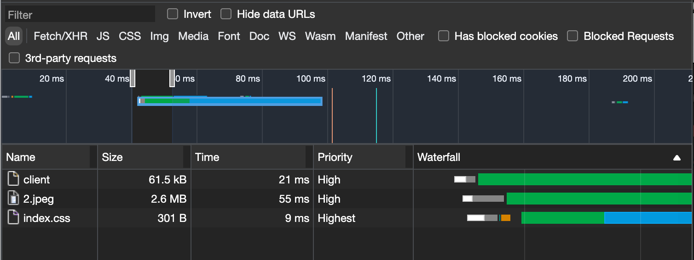

# preload

## 介绍
`preload` 影响资源的加载顺序，将隐藏的后置加载的资源前置化。

## 语法
```js
<link rel="preload" href="/src/2.jpeg" as="image">

// 跨域资源需要添加 crossorigin 属性
<link rel="preload" href="http://www.baidu.com/2.jpeg" as="image" crossorigin>
```

### as 属性

`as` 属性仅作用于 `rel="prefetch"` 和 `rel="preload"` 。

使用 `as` 属性指定加载资源的类型，对于浏览器来说有如下优点：
  1. 更加准确地确定资源加载的优先级；
  2. 为资源应用正确的 `Content Security Policy (CSP)` ；
  3. 设置正确的请求头 - Accept；

`as` 属性值与资源类型对照表：
| as Value    | Applies To |
| ----------- | ----------- |
|audio| Audio file, as typically used in `<audio>`.|
|document| An HTML document intended to be embedded by a `<frame>` or `<iframe>`.|
|embed| A resource to be embedded inside an `<embed>` element.|
|fetch| Resource to be accessed by a fetch or XHR request, such as an ArrayBuffer or JSON file.|
|font| Font file.|
|image| Image file.|
|object| A resource to be embedded inside an `<object>` element.|
|script| JavaScript file.|
|style| CSS stylesheet.|
|track| WebVTT file.|
|worker| A JavaScript web worker or shared worker.|
|video| Video file, as typically used in `<video>`.|

## 实例
> origin: http://localhost:3000

1. 未使用 preload

```html
<!DOCTYPE html>
<html lang="en">
  <head>
    <meta charset="UTF-8" />
    <link rel="icon" href="/favicon.ico" />
    <meta name="viewport" content="width=device-width, initial-scale=1.0" />

    <!-- <link rel="preload" href="/src/2.jpeg" as="image"> -->

    <link rel="stylesheet" href="/src/styles/index.css">
    <!--
      index.css 代码如下：
        .main { background: url('/src/2.jpeg'); }
    -->

    <title>Vite App</title>
  </head>
  <body>
    <div class="main">jsx</div>
  </body>
</html>
```

<br />

通过 Network 面板中的 Waterfall 可以看出：

  1. 加载 `index.css` 资源；
  2. 等完全加载 `index.css` 资源后，又过了若干毫秒；
  3. 加载 `index.css` 内部的图片资源 `2.jpeg`。

`index.css` `2.jpeg` 两个资源的加载顺序关系为串联，资源加载时间过长。

2. 使用 preload 预渲染

```html
<!DOCTYPE html>
<html lang="en">
  <head>
    <meta charset="UTF-8" />
    <link rel="icon" href="/favicon.ico" />
    <meta name="viewport" content="width=device-width, initial-scale=1.0" />

    <link rel="preload" href="/src/2.jpeg" as="image">

    <link rel="stylesheet" href="/src/styles/index.css">
    <!--
      index.css 代码如下：
        .main { background: url('/src/2.jpeg'); }
    -->

    <title>Vite App</title>
  </head>
  <body>
    <div class="main">jsx</div>
  </body>
</html>
```

<br />

通过 Network 面板中的 Waterfall 可以看出：

1. 先加载 `2.jpeg` 资源( `<link rel="preload" href="/src/2.jpeg" as="image">` )后；
2. 紧接着又开始加载 `index.css` 资源( `<link rel="stylesheet" href="/src/styles/index.css">` )。

`index.css` `2.jpeg` 两个资源的加载顺序关系为并联，大大节约了资源的加载时间！
