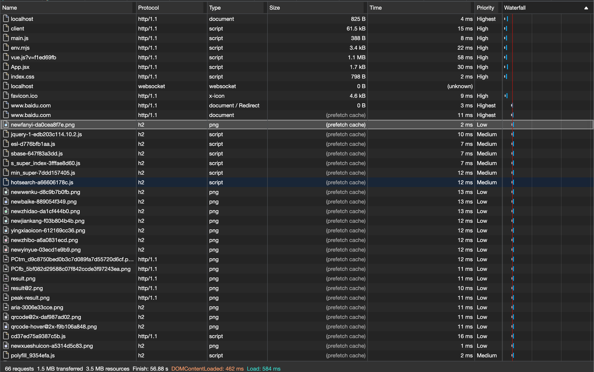

# prerender

## 介绍
`prerender` 不仅会预加载资源，还会进行预渲染。具体情况需要根据浏览器自身进行判断：
1. 分配少量浏览器资源对请求的资源进行预渲染；
2. 挂起部分请求直到请求资源可见时；
3. 如果浏览器资源消耗过多，可能会放弃预渲染；
4. 等等情况。。。

## 语法
```js
<link rel="prerender" href="http://www.baidu.com">

// 跨域资源需要添加 crossorigin 属性
<link rel="prerender" href="http://www.baidu.com" crossorigin>
```

## 实例
> origin: http://localhost:3000

1. 未使用 prerender

```html
<!DOCTYPE html>
<html lang="en">
  <head>
    <meta charset="UTF-8" />
    <link rel="icon" href="/favicon.ico" />
    <meta name="viewport" content="width=device-width, initial-scale=1.0" />
    <!-- <link rel="prerender" href="http://www.baidu.com" crossorigin> -->
    <title>Vite App</title>
  </head>
  <body>
    <div id="app"></div>
    <script type="module" src="/src/main.js"></script>

    <script>
      setTimeout(() => {
        location.href = 'http://www.baodi.com'
      }, 1000 * 10)
    </script>
  </body>
</html>
```

<br />

通过 Network 面板的内容可以看出，原页面跳转 `www.baidu.com` 页面时，正常加载页面，大部分请求的资源耗时都在 `100 ms` 以上。

2. 使用 prerender 预渲染

```html
<!DOCTYPE html>
<html lang="en">
  <head>
    <meta charset="UTF-8" />
    <link rel="icon" href="/favicon.ico" />
    <meta name="viewport" content="width=device-width, initial-scale=1.0" />
    <link rel="prerender" href="http://www.baidu.com" crossorigin>
    <title>Vite App</title>
  </head>
  <body>
    <div id="app"></div>
    <script type="module" src="/src/main.js"></script>

    <script>
      setTimeout(() => {
        location.href = 'http://www.baodi.com'
      }, 1000 * 10)
    </script>
  </body>
</html>
```

<br />

通过 Network 面板的内容可以看出，原页面跳转 `www.baidu.com` 页面时，大部分请求资源都来自 `prefetch cache` ，请求的资源耗时在 `20 ms` 以下。大大缩短了页面渲染的消耗时间！
